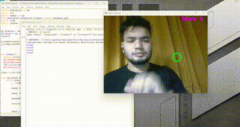

# 🎮 Hand Tracking Game with OpenCV & MediaPipe

Welcome to the **Hand Tracking Enemy Game**, a fun and interactive mini-game that uses your **hand gestures** to hit enemies on the screen in real time! This project combines the power of **OpenCV** and **MediaPipe** to create a motion-controlled gaming experience using just your webcam.

---

## 🎥 Demo

> 👇 Here's how the game looks in action:



---

## ⚡ How to Play

- Use your **index finger** to “hit” the enemy (a green circle).
- Every time your finger touches the circle, your score increases and the enemy jumps to a new position.
- Press `Q` to quit the game.

---

## ✨ Features

- 🖐️ Real-time hand tracking using MediaPipe
- 🎯 Score increases on enemy hit
- 🕹️ Randomized enemy location for challenge
- 🧠 Gesture recognition via index finger tip
- 🔄 Live webcam feed processing

---

## 🧠 How It Works

1. **MediaPipe Hands** is used to detect the position of the index finger in real time.
2. A circle (enemy) is rendered at a random screen position.
3. If the detected fingertip overlaps with the circle (within range), the score increases.
4. The enemy circle moves to a new random location, and the game continues.

---

## 🛠️ Setup

### 🔧 Requirements

- Python 3.x
- OpenCV
- MediaPipe
- Numpy

### 📦 Install Dependencies

```bash
pip install opencv-python mediapipe numpy
